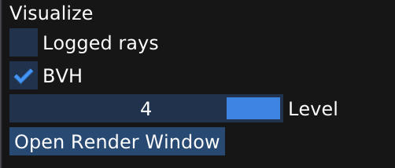
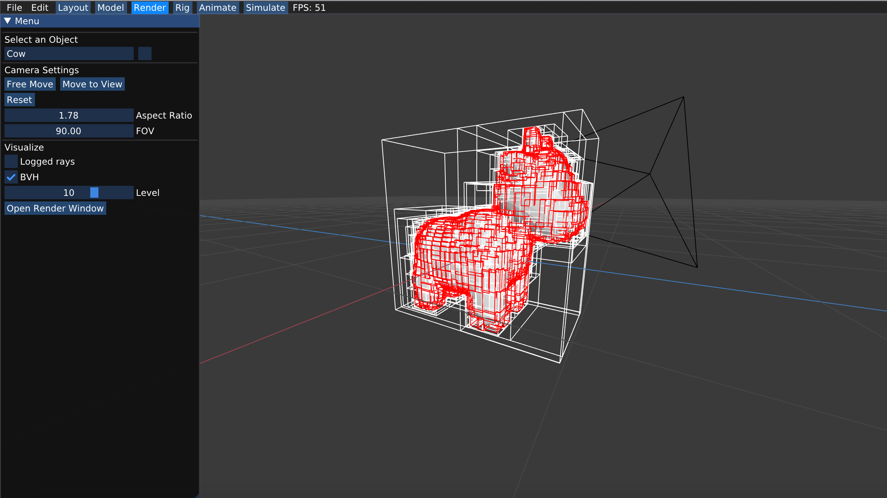
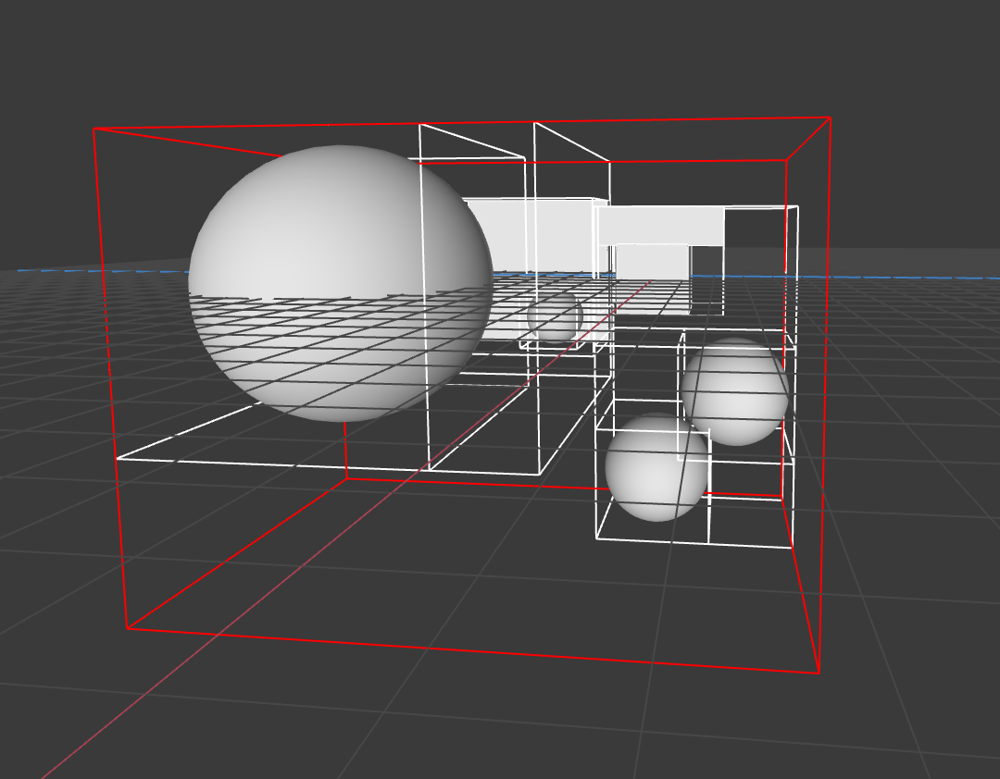
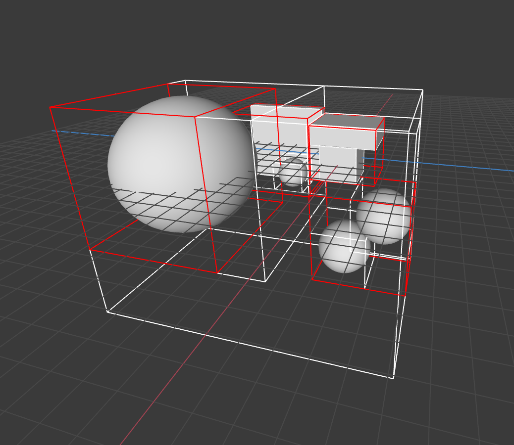
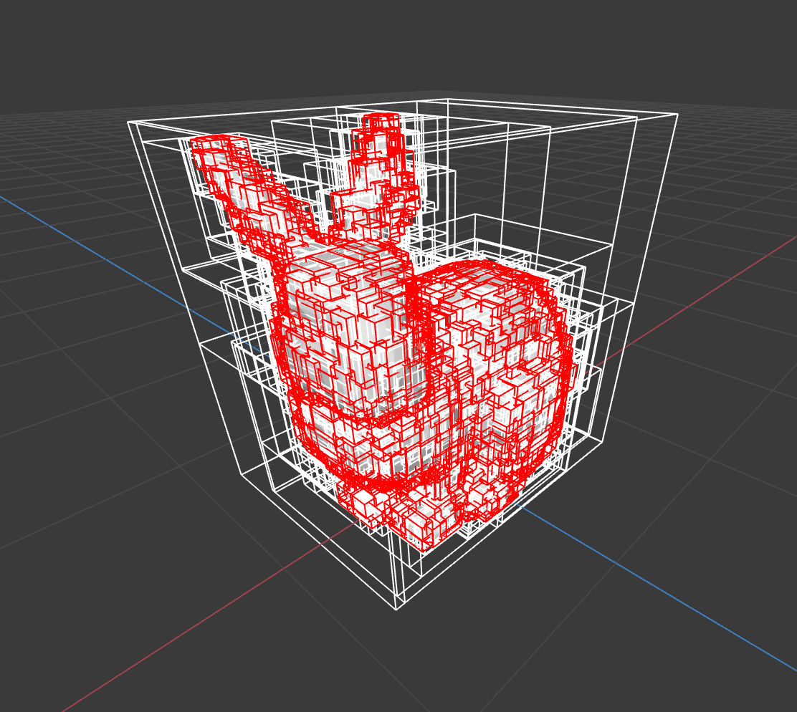

# (Task 3) Bounding Volume Hierarchy

In this task you will implement a bounding volume hierarchy (BHV) that accelerates ray-scene intersection. Most of this work will be in `student/bvh.inl`. Note that this file has an unusual extension (`.inl` = inline) because it is an implementation file for a template class. This means `bvh.h` must `#include` it, so all code that includes `bvh.h` will also include `bvh.inl`.

We are going to guide you toward implementing a BVH that is laid out in memory in a manner that speeds up the performance of ray tracing. This will be a little more complicated than a naive BVH tree implementation, but you'll thank us later when you see your render times. ;-)

First, take a look at the definition for our `BVH` in `rays/bvh.h`. Instead of representing the BVH as a tree of nodes connected by pointers, we represent a BVH using a vector of `Node`s (`nodes`) that forms an implicit tree data structure. A `Node` has the following fields:

* `BBox bbox`: the bounding box of the node (this bounds all primitives in the subtree rooted by this node)
* `size_t l`: the index of the left child node in the node's array
* `size_t r`: the index of the right child node in the node's array
* `size_t start`: starting index of primitives in the `BVH`'s primitive array
* `size_t size`: the number of primitives in the subtree rooted by the node

The BVH class also maintains a vector of all primitives in the BVH. The fields `start` and `size` in a BVH `Node` refer to a range of primitives contained in this array. Before the BVH is built, the primitives in this array are not in any particular order. You will need to _rearrange the order_ as you build the BVH so that all primitives in a subtree of the BVH are adjacent in the primitives array.

The starter code constructs a valid BVH, but it is a trivial BVH with only three nodes, a root and two children. The first input primitives is in the left node of the root, and all other primitives are in the right node.  Please see the starter code for a detailed description of the mechanics of building a BVH. 

## Step 0: Bounding Box Calculation

Implement `BBox::hit` in `student/bbox.cpp`. This needs to be an implementation of ray/bbox intersection.  Also, if you haven't already, implement `Triangle::bbox` in `student/tri_mesh.cpp`.

## Step 1: BVH Construction

Your job is to construct a `BVH` using the [Surface Area Heuristic](https://gfxcourses.stanford.edu/cs248a/winter23/lecture/accelstructure/slide_47) discussed in class. Tree construction will occur when an instance of the BVH object is constructed.

## Step 2: Ray-BVH Intersection

Implement the ray-BVH intersection routine `Trace BVH<Primitive>::hit(const Ray& ray)`. You may wish to consider the node visit order optimizations we discussed in class. Once complete, your renderer should be able to render all of the test scenes in a reasonable amount of time. 

## Visualization

In Render mode, simply check the box for "BVH", and you would be able to see the BVH you generated in task 3 when you **start rendering**. You can click on the horizontal bar to see each level of your BVH. Note that the BVH visualizer will start drawing the BVH from the node given by `BVH::root_idx`, so be sure to set this to the proper index (probably 0 or `nodes.size() - 1`, depending on your implementation) when you build the BVH.

The bvh constructed for spot on the 10th level.

The bvh constructed for a scene composed of several cubes and spheres on the 0th level.

The bvh constructed for a scene composed of several cubes and spheres on the 1st level.

The bvh constructed for bunny on the 10th level.

