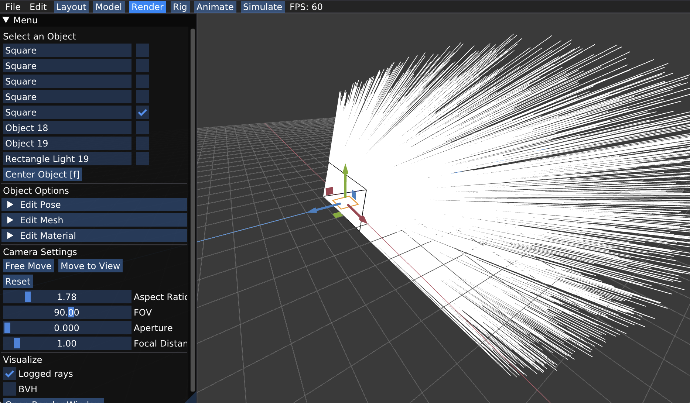

# (Task 1) Generating Camera Rays

"Camera rays" emanate from the camera and measure the amount of scene radiance that reaches a point on the camera's sensor plane. (Given a point on the virtual sensor plane, there is a corresponding camera ray that is traced into the scene.)

To get started take a look at `Pathtracer::trace_pixel` in `student/pathtracer.cpp`. The job of this function is to compute the radiance arriving at a point within pixel of the image. Conveniently, we've given you a function `Pathtracer::trace_ray(r)` that provides a measurement of incoming scene radiance along the direction given by ray `r`. See `lib/ray.h` for the interface of ray (`r.point` is the ray origin, `r.dir` is the ray direction).  __Your job in Task 1 is to generate the ray `r` that is passed to `trace_ray(r)`.__

Here's how to do it:

**Step 1:** Given the width and height of the screen, and point in screen space, compute the corresponding coordinates of the point in normalized ([0-1]x[0-1]) screen space in `Pathtracer::trace_pixel`. Pass these coordinates to the camera via `Camera::generate_ray` in `camera.cpp`.

**Step 2:** Implement `Camera::generate_ray`. This function should return a ray **in world space** that reaches the given sensor sample point. We recommend that you compute this ray in camera space (where the camera pinhole is at the origin, the camera is looking down the -Z axis, and +Y is at the top of the screen.). In `util/camera.h`, the `Camera` class stores `vert_fov` and `aspect_ratio` indicating the vertical field of view of the camera (in degrees, not radians) as well as the aspect ratio. Note that the camera class maintains camera-space-to-world space transform matrix `iview` that will come fairly handy. 

**Step 3:** Your implementation of `Pathtracer::trace_pixel` must support super-sampling. The starter code will call `Pathtracer::trace_pixel` once for each sample (given by `Pathtracer::n_samples`) and take take of the per-pixel resolve of the results. Your implementation of `Pathtracer::trace_pixel` must choose a new location within the pixel each time. This is equivalent to saying that the ray tracer wil shoot `n_samples` camera rays per pixel.

When the renderer is configured to use 1 sample per pixel (`Pathtracer::n_samples`), your implementation should sample incoming radiance at the center of the specified pixel by constructing a ray `r` that begins at this sensor location and travels through the camera's pinhole. When the renderer is configured to use more than one sample per pixel, your implementation should choose a unique random location in the specified pixel for each ray. To choose a sample location within the pixel, please implement `Rect::Uniform::sample` (see `src/student/samplers.cpp`), such that it provides (random) uniformly distributed 2D points within the rectangular region specified by (0,0) and `Rect::Uniform::size.x` and Rect::Uniform::size.y. Once you've done this, your implementation of `trace_pixel` can create `Rect::Uniform` sampler with a one-by-one region and call `sample()` to obtain randomly chosen offsets within the pixel.  You'll need to convert this pixel-space 2D location to a normalized screen-space location prior. to calling `Camera::generate_ray`.

Once you have implemented `Pathtracer::trace_pixel`, `Rect::Uniform::sample` and `Camera::generate_ray`, you should have a working camera.

**Tip:** Since it'll be hard to know if you camera rays are correct until you implement primitive intersection, we recommend debugging your camera rays by checking what your implementation of `Camera::generate_ray` does with rays at the center of the screen (0.5, 0.5) and at the corners of the image (0,0) and (w,h).

The starter code can log the results of raytracing for visualization and debugging. To do so, simply call function `Pathtracer::log_ray` in your `Pathtracer::trace_pixel`. Function `Pathtracer::log_ray` takes in 3 arguments: the ray thay you want to log, a float that specifies the time/distance to log that ray up to, as well as the color to render the ray as. If not provided, the color as it is being set to white by default. If you draw all rays, you won't be able to see much about what's going on. Instead we rercommend you only log only a portion of the generated rays for a better visualization. For example, do `if (RNG::coin_flip(0.0005f))log_ray(out, 10.0f);` to log 0.05% of generated camera rays.

You can visualize the result of the generated rays by checking the box for "Logged rays" under Visualize in the app and then **start render**(Open Render Window -> Start Render). After running the ray tracer, rays will be shown as lines in visualizer. Be sure to wait for rendering to complete so you see all rays while visualizing. A message is printed to standard output on completion. 

**Extra credit ideas:**

* Modify the implementation of the camera to simulate a camera with a finite aperture (rather than a pinhole camera). This will allow your ray tracer to simulate the effect of defocus blur.
* Write your own sampler that generates samples with improved distribution. Some examples include:
  * Jittered Sampling
  * Multi-jittered sampling
  * N-Rooks (Latin Hypercube) sampling
  * Sobol sequence sampling
  * Halton sequence sampling
  * Hammersley sequence sampling
